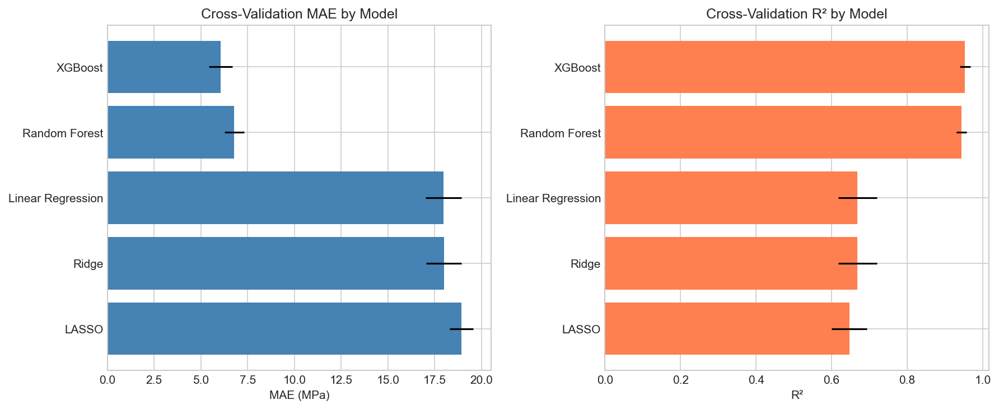
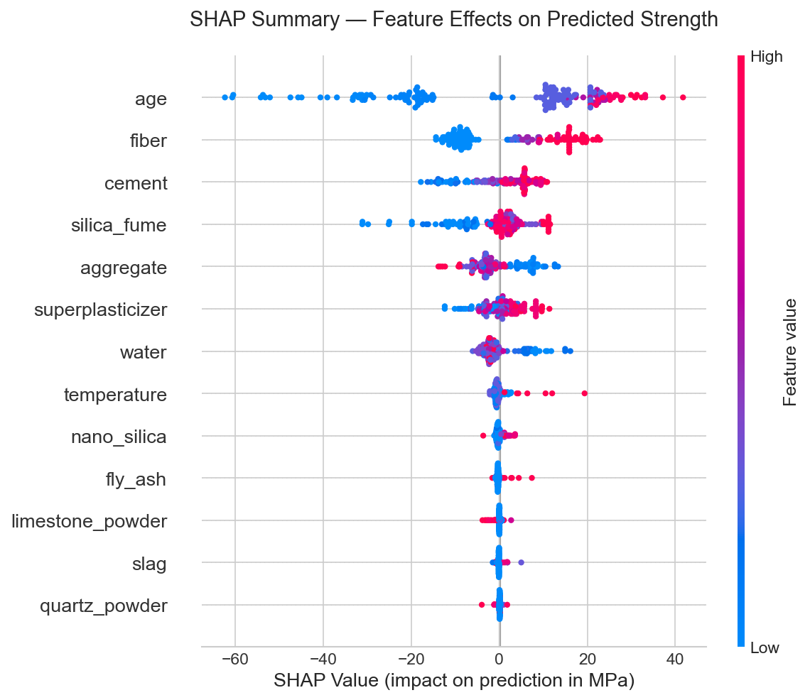
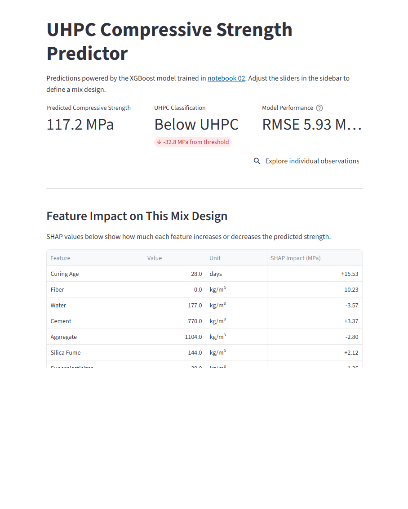

# UHPC Compressive Strength Prediction

## Overview

Ultra-High-Performance Concrete (UHPC) is a promising technology with significant structural advantages. However, determining optimal mix proportions can require costly and time-consuming physical testing. To address this issue, this project explores using machine learning to predict compressive strength, with the goal of offering a more efficient approach to mix design and potential to accelerate development.

To explore this, five regression models, including Linear Regression, Ridge, LASSO, Random Forest, and XGBoost, were evaluated for predicting compressive strength. Performance was assessed using RMSE, cross-validation, and hyperparameter tuning with GridSearchCV. XGBoost provided the best results with an RMSE of 5.93 MPa (R² = 0.978). To interpret the model's predictions, SHAP analysis was applied to assess feature contributions at both the global and individual level.

---

## Approach

The analysis follows a three-stage notebook pipeline outlined below.

1. **Exploratory Analysis** — Validate data quality, examine feature distributions, review correlations and assess multicollinearity
2. **Model Development** — Evaluate five regression models using cross-validation, select and tune the best performer
3. **Model Interpretation** — Apply SHAP to understand global feature impact and explain individual predictions

The project also includes an interactive Streamlit app based on SHAP analysis, where users can adjust mix components and explore how each change influences predicted strength (see [below](#streamlit-app)).

---

## Results

Model performance was evaluated using RMSE and R² on a held-out test set.

### Model Performance

- **XGBoost achieved 5.93 MPa RMSE (R² = 0.978)**
- Tree-based models substantially outperformed linear models (RMSE ~8–9 MPa vs ~23 MPa)
- Random Forest performed strongly but slightly below XGBoost

### Feature Importance

Top predictors identified via SHAP:

1. **Age**
2. **Fiber**
3. **Cement**
4. **Silica fume**

### SHAP Insights

- Age had the strongest influence on predicted strength
- Higher curing time consistently increased predictions
- Low curing time significantly reduced predictions
- Fiber, cement, silica fume, and superplasticizer were generally associated with higher predicted strength
- Higher water and aggregate content were associated with lower predicted strength

---

## Streamlit App

- **Strength Predictor** — Adjust mix design sliders to get a predicted compressive strength with per-feature SHAP explanation
- **Observation Explorer** — Browse all 792 observations, filter by strength range or material presence, and select any row to see the model's prediction and feature-level impact

Run locally:

    streamlit run app/app.py

---

## Limitations

- Moderate dataset size (792 records after cleaning) with no external validation dataset
- Bootstrap prediction intervals achieved 81.8% coverage vs. the 95% nominal target, suggesting the need for an alternative uncertainty method
- Analysis used raw mix design features only; feature engineering was not explored

---

## Next Steps

A detailed analysis report was created that identified the possible enhancements below. These were captured in an enhancement roadmap located in [`docs/`](docs/).

- Engineer domain-informed features such as water-to-cement and water-to-binder ratios
- Explore conformal prediction for more accurate uncertainty bounds
- Add Spearman correlations and segmented residual analysis to strengthen diagnostic coverage
- Explore use of alternate correlation thresholds to better identify feature relationships
- Implement repeated k-fold cross-validation
- Compare feature importance methods (SHAP vs. permutation vs. gain-based) and add SHAP dependence plots
- Evaluate additional models (Elastic Net, MLP, SVR) and Bayesian hyperparameter tuning via Optuna
- Compare model performance against published ML concrete strength studies to benchmark results 

---

## Data

- **Source:** Kashem, A., et al. (2023). Ultra-High-Performance Concrete (UHPC). Mendeley Data  
- **Records:** 810 mix designs (792 after duplicate removal)  
- **Features (13):** cement, slag, silica_fume, limestone_powder, quartz_powder, fly_ash, nano_silica, aggregate, water, fiber, superplasticizer, temperature, age  
- **Target:** compressive_strength (MPa)

---

## Tech Stack

- Python 3.14
- pandas, NumPy
- scikit-learn
- XGBoost
- SHAP
- statsmodels
- matplotlib, seaborn
- Streamlit
- Jupyter

---

## References

- Kashem, A., et al. (2023). Ultra-High-Performance Concrete (UHPC). Mendeley Data. https://data.mendeley.com/datasets/85r7bh4zsz/1

**K Flowers**
GitHub: [KRFlowers](https://github.com/KRFlowers)